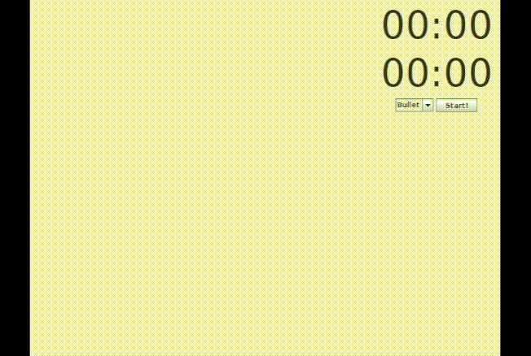

# Chess Local Multiplayer: Java

This is a chess game designed for local multiplayer gameplay created using the Java GUI package swing. 

<div align="center">
  
</div>

## About
Refer to the [documentation](https://github.com/m4mbo/chess-local-multiplayer/tree/main/docs) directory for information on requirements, class interaction and testing.

## Build and Run

```
./run.sh
```


